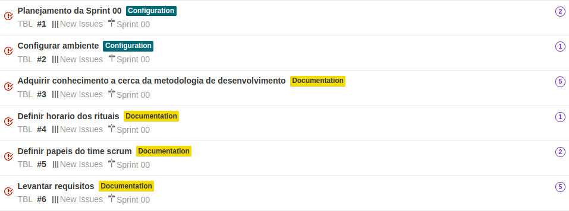
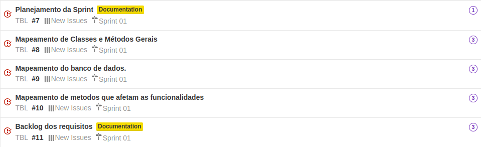
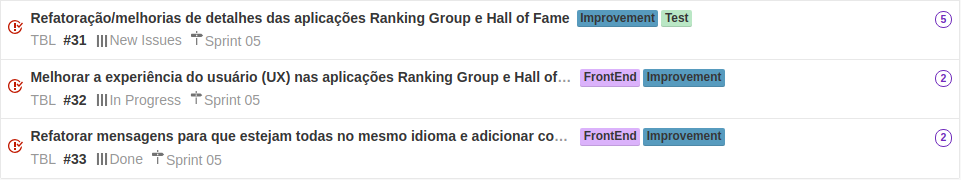
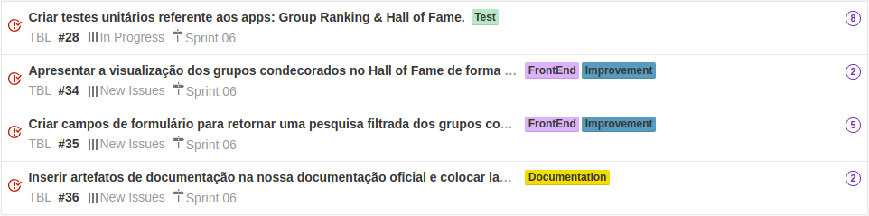
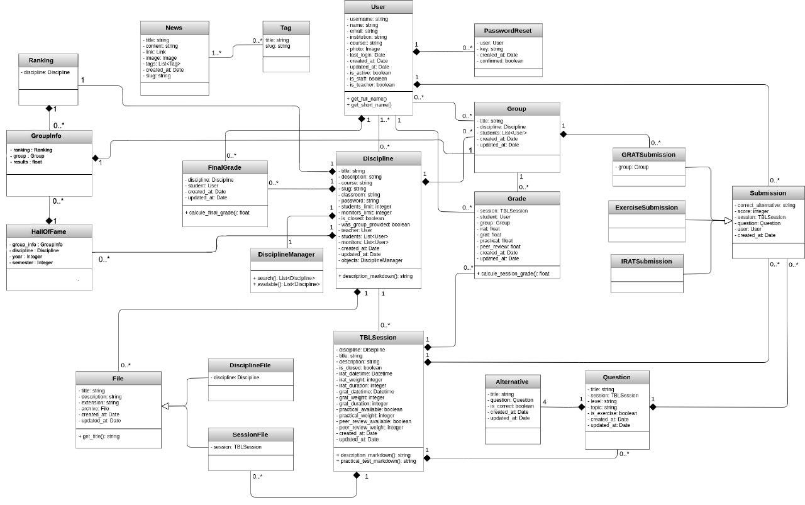

# Artefatos para documentação oficial
Nesta página encontra-se todos os artefatos da documentação oficial [TBL](https://victorarnaud.github.io/TBL/) que foram atualizados decorrente da criação do aplicativos:

* Group Ranking
* Hall of Fame

# Product Backlog

## Histórias de usuário e backlog das Sprints

### Sprint00

### Sprint01

### Sprint02

### Sprint03

### Sprint04

### Sprint05

### Sprint06

***

# Diagrama de classe

***

# MER

## **Entidades e Atributos**

### **Ranking**:

Atributo | Tipo	| Característica | Descrição
---------|------|----------------|----------
discipline_id | Discipline | obrigatório | Disciplina na qual o Ranking de grupos pertence.

### **GroupInfo**:

Atributo | Tipo	| Característica | Descrição
---------|------|----------------|----------
results | float | automático, padrão 0 | Nota de desempenho do grupo com a média de todas as suas avaliações iRAT, gRAT, prática e em pares.
group_id | Group | obrigatório | Grupo na qual estas informações pertencem.
ranking_id | Ranking | obrigatório | Ranking de grupos no qual este GroupInfo está vinculado.  

### **HallOfFame**:

Atributo | Tipo	| Característica | Descrição
---------|------|----------------|----------
year | inteiro positivo | obrigatório | Ano no qual este objeto do HallOfFame pertence.
semester | inteiro positivo | opcional, padrão 0 | Semestre no qual este objeto do HallOfFame pertence.
discipline_id | Discipline | obrigatório | Disciplina no qual este objeto do HallOfFame pertence.
group_info_id | GroupInfo | obrigatório | GroupInfo vinculado a este objeto do HallOfFame.

## **Relacionamentos entre classes**

RANKING tem DISCIPLINE:

* Um ranking de grupos deve ter uma disciplina, e uma disciplina pode ter vários rankings de grupos.
* Cardinalidade: Nx1

GROUPINFO tem GROUP:

* Uma informações de um grupo deve ter um grupo, e um grupo deve ter uma informações de um grupo.
* **Cardinalidade:** 1x1

GROUPINFO tem RANKING:

* Uma informações de um grupo deve ter um ranking de grupo, e um ranking de grupos pode ter várias informações de grupos.
* **Cardinalidade:** Nx1

HALLOFFAME tem DISCIPLINE:

* Um hall da fama deve ter uma disciplina, e uma disciplina pode ter vários halls da fama.
* **Cardinalidade:** Nx1

GROUPINFO pertence HALLOFFAME:

* Uma informações de um grupo pode pertencer a um hall da fama, porém um hall da fama pode ter várias infromações de um grupo.
* **Cardinalidade:** Nx1

RANKING pertence DISCIPLINE:

* Um ranking de grupos peetence a uma disciplina, porém uma disciplina pode ter vários rankings de grupos diferentes.
* **Cardinalidade:** Nx1

***